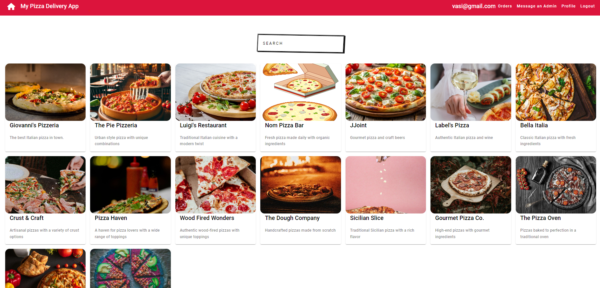
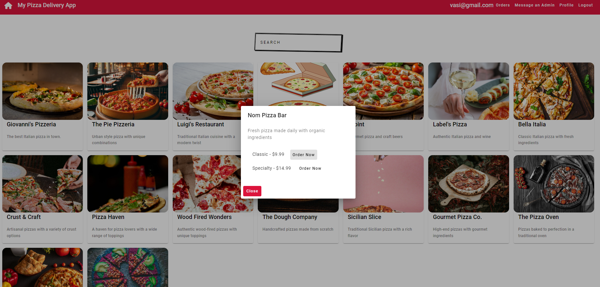
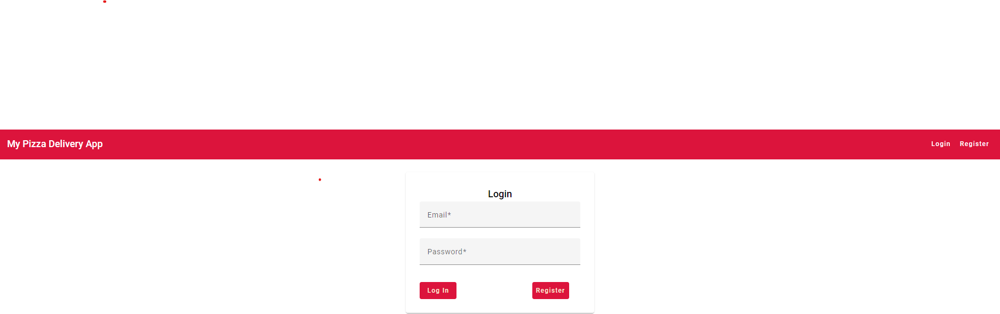
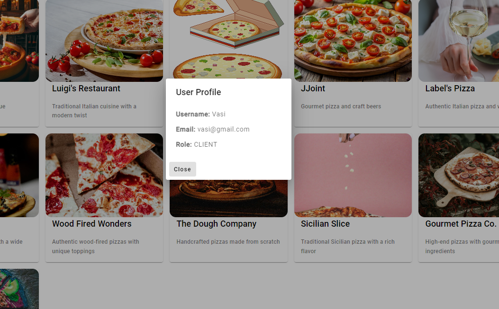

# Pizza Delivery Web App

## Overview


The Pizza Delivery Web App is a full-stack application designed to streamline pizza ordering and management. This application is built using modern web technologies to provide a seamless and secure user experience.

## Features

- **Frontend:**
    - Developed using Angular for a dynamic and interactive user interface.
    - Angular Material is utilized for modern design and responsiveness.
    - Custom CSS is employed to fine-tune layout and styling.

- **Backend:**
    - Implemented with Java Spring Boot, featuring a layered architecture.
    - Utilizes Data Transfer Objects (DTOs), services, and controllers to handle functionalities such as authentication, restaurant management, user interactions, and administrative controls.

- **Security:**
    - JSON Web Tokens (JWT) are used for secure user authentication and authorization.

- **Image Management:**
    - Users can upload and view photos related to restaurants.
    - Photo paths are managed in the `./images` folder.

- **Real-time Statistics:**
    - Redis is used for real-time user statistics, accessible only to connected admins.

- **Administrative Controls:**
    - Features for managing restaurants, users, and system settings are provided for managers and admins.

## Images

Here are some example images used in the app:
- 
- 
- 

## Technologies Used

- **Frontend:** Angular, Angular Material, CSS
- **Backend:** Java Spring Boot
- **Security:** JWT
- **Database:** MySQL
- **Real-time Data:** Redis

## Installation

To get started with the project, follow these steps:

1. `git clone <repository-url>`  
2.**Frontend Installation:**
```bash
cd frontend
npm install
```
And then just start the app:  
```bash
npm start
```
3.**Backend Installation:**  
```bash
cd backend
./mvnw install
 ```  
Add the database to the application.properties,also you could add:
```bash
spring.servlet.multipart.max-file-size=10MB
spring.servlet.multipart.max-request-size=10MB
```  
and in the end do:
```bash
./mvnw spring-boot:run
```